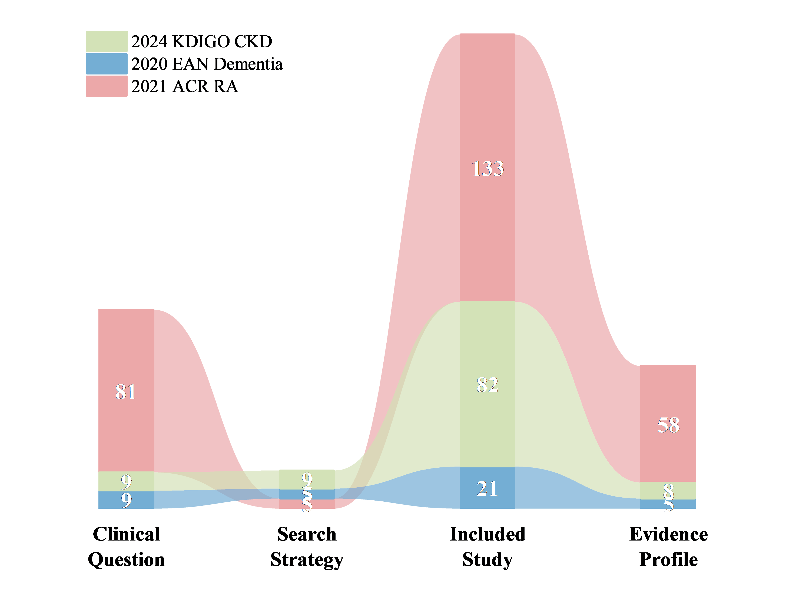

# Quicker
From Questions to Clinical Recommendations: Large Language Models Driving Evidence-Based Clinical Decision-Making

## 🎉 News

> **🎊 Published [Dec 2025]**  
> 📰 Our manuscript has been **published** in **npj Digital Medicine**! ✨  
> 📝 **Published Article:** [Streamlining Evidence Based Clinical Recommendations with Large Language Models](https://www.nature.com/articles/s41746-025-02273-y)  
> 🔗 **Preprint Manuscript:** [From Questions to Clinical Recommendations: Large Language Models Driving Evidence-Based Clinical Decision Making](
https://doi.org/10.48550/arXiv.2505.10282)

`Quicker` is a large language model (LLM)-driven clinical decision support workflow that automates the entire process from clinical questions to evidence-based recommendations. Inspired by the methodology of clinical guideline development, Quicker streamlines decision-making and improves efficiency in evidence synthesis.

`Q2CRBench-3` is a benchmark dataset designed to evaluate the performance of `Quicker` in generating clinical recommendations. It is derived from the development records of three authoritative clinical guidelines: [the 2020 EAN guideline for dementia](https://onlinelibrary.wiley.com/doi/10.1111/ene.14412), [the 2021 ACR guideline for rheumatoid arthritis](https://acrjournals.onlinelibrary.wiley.com/doi/10.1002/art.41752), and [the 2024 KDIGO guideline for chronic kidney disease](https://www.kidney-international.org/article/S0085-2538(23)00766-4/fulltext).

Update: A [more curated version of the dataset](https://huggingface.co/datasets/somewordstoolate/Q2CRBench-3) has been released on Hugging Face for broader accessibility and reproducibility.

# 🚀 Quick Start

Quicker operates in five sequential phases:
Question Decomposition → Literature Search → Study Selection → Evidence Assessment → Recommendation Formulation
Each phase builds upon the output of the previous, so we recommend running the workflow in order for first-time users.

## 🔽 Installation
Clone the repository and install the dependencies:
```bash
git clone git@github.com:somewordstoolate/Quicker.git
pip install -r requirement.txt # python version: 3.11.10
```

## 🔧 External Dependencies
This project requires several third-party components. You can deploy or configure them based on your environment:
1. [GROBID](https://grobid.readthedocs.io/en/latest/Introduction/): a machine learning library for extracting, parsing and re-structuring raw documents such as PDF into structured XML/TEI encoded documents. Used for full-text content extraction.
2. [Alibaba-NLP/gte-Qwen2-1.5B-instruct](https://huggingface.co/Alibaba-NLP/gte-Qwen2-1.5B-instruct) (requires GPU):  A multilingual embedding model that performs well in the medical domain. Used to convert text into vector representations.
3. [vLLM](https://github.com/vllm-project/vllm) (requires GPU):  a fast and easy-to-use library for LLM inference and serving. We use it to deploy local LLMs and expose them via API.
4. [Qdrant](https://github.com/qdrant/qdrant): a vector similarity search engine and vector database.

## ⚙️ Hyperparameters and Configuration
Before running Quicker, create a config.json file (see example in the config folder). The following parameters can be set in different values:
* `temperature` (float): Default is 1.0 (this is the value used in all our experiments).
* We use the default model parameter settings as specified on each model’s official site, or as recommended by the model providers. If you wish to customize these values, you can do so by modifying the `get_model` method in the `Quicker` class.
* `record_screening_method`(str): `"basic"` or `"cot"` — the method used for record screening.
* `exp_num` (int): Number of repeated screenings.
* `threshold` (int): Threshold T for full-text assessment inclusion (only records included at least T runs will be finally included). Must satisfy `threshold <= exp_num`.

The default `random seed` is 42. If needed, you can rename the `env.example` file to `.env` and set your preferred random seed.

For easier understanding of the architecture, all prompts for each phase of Quicker are saved in their respective utils/`workflow_phase`/prompt.py files.

## 📂 Datasets

You may use the `Q2CRBench-3` dataset or your own clinical question and study corpus to evaluate Quicker. Detailed descriptions of the benchmark datasets can be found in the desc.md file within each corresponding dataset folder.

<div align="center">

</div>

Due to copyright restrictions, we are unable to share partial publications directly. However, you can reproduce the test records by following the provided search strategies and use public tools such as [Crossref](https://www.crossref.org/) and [OpenAlex](https://openalex.org/) to retrieve the necessary bibliographic and access information.

To facilitate reproducibility, we provide a `literature_hashes.jsonl` file in the `Q2CRBench-3\reproducibility` folder. This file contains SHA256 hashes computed from vector database files produced by GROBID text extraction and Qdrant vectorization (see [example file](data/2021ACR%20RA/Paper_Library/PICOef0e4f95/566c1573/566c1573_vector_database/collection/paper_566c1573_vector/storage.sqlite)). You can use the following code to generate the hash of your own `storage.sqlite` file and compare it with the provided hash to ensure alignment of results. We also include the search strategies generated by Quicker during our experiments in the `Q2CRBench-3\reproducibility\search_strategies` directory.

```python
import os, hashlib, json

def file_sha256(path):
    sha = hashlib.sha256()
    with open(path, "rb") as f:
        for chunk in iter(lambda: f.read(4096), b""):
            sha.update(chunk)
    return sha.hexdigest()

path = <your_file_path>

hash_value = file_sha256(path)
```


# Citation

```
@article{liStreamliningEvidenceBased2025,
  title = {Streamlining Evidence Based Clinical Recommendations with Large Language Models},
  author = {Li, Dubai and Jiang, Nan and Huang, Kangping and Tu, Ruiqi and Ouyang, Shuyu and Yu, Huayu and Qiao, Lin and Yu, Chen and Zhou, Tianshu and Tong, Danyang and Wang, Qian and Li, Mengtao and Zeng, Xiaofeng and Tian, Yu and Tian, Xinping and Li, Jingsong},
  year = 2025,
  month = dec,
  journal = {npj Digital Medicine},
  publisher = {Nature Publishing Group},
  issn = {2398-6352},
  doi = {10.1038/s41746-025-02273-y},
  urldate = {2025-12-26},
  copyright = {2025 The Author(s)},
  langid = {english},
  keywords = {Health care,Literature mining}
}
```